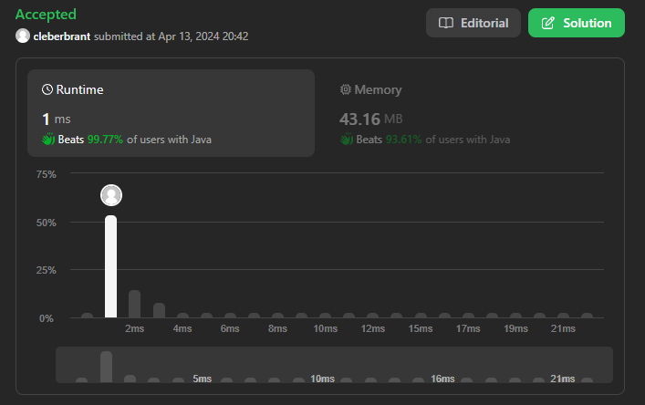
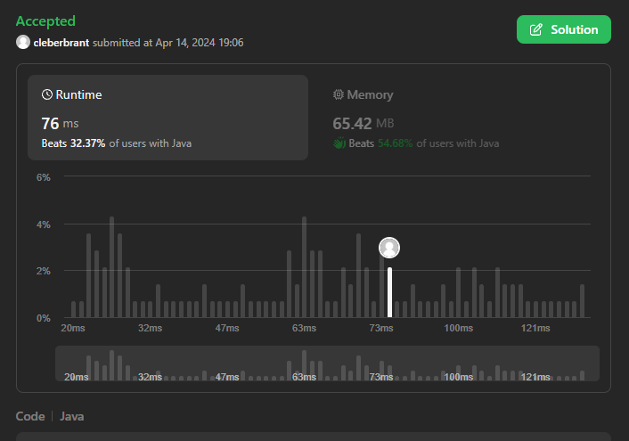

# Grafos 1 - Online Judge Leet Code

**Conteúdo da Disciplina**: Grafos 1 

## Alunos
|Matrícula | Aluno |
| -- | -- |
| 20/0061216  |  Cleber de Oliveira Brant |
| 20/0044559  |  Wesley Lira Carvalho |

## Sobre 
O trabalho do modulo 1 consiste na resolução de 4 questões difíceis de grafos que encontramos na plataforma Leet Code.

- [1494. Parallel Courses II](https://leetcode.com/problems/parallel-courses-ii/description/)
- [2876. Count Visited Nodes in a Directed Graph](https://leetcode.com/problems/count-visited-nodes-in-a-directed-graph/description/)
- [685. Redundant Connection II](https://leetcode.com/problems/redundant-connection-ii/description/)
- [2603. Collect Coins in a Tree](https://leetcode.com/problems/collect-coins-in-a-tree/description/)

## Screenshots

### 1494. Parallel Courses II

### 2876. Count Visited Nodes in a Directed Graph

### 685. Redundant Connection II

### 2603. Collect Coins in a Tree

## Uso no Leet Code
É recomendado que a Solution dos exercícios seja executada diretamente no juiz online Leet Code, copiando os códigos Solution.java de cada pasta(retirar apenas o package na primeira linha) destinada para cada questão, onde haverá maior carga de testes para visualizar o retorno do código submetido.

**Observação**: é necessário que crie uma conta dentro do Leet Code para que possa submeter o código no Juiz Online.

Link dos exercícios no Juiz Online Leet Code:

- [1494. Parallel Courses II](https://leetcode.com/problems/parallel-courses-ii/description/)
- [2876. Count Visited Nodes in a Directed Graph](https://leetcode.com/problems/count-visited-nodes-in-a-directed-graph/description/)
- [685. Redundant Connection II](https://leetcode.com/problems/redundant-connection-ii/description/)
- [2603. Collect Coins in a Tree](https://leetcode.com/problems/collect-coins-in-a-tree/description/)

## Uso local
Para poder rodar os exercícios de forma local, é necessário que tenha instalado em seu computador o **JDK 17** e variáveis de ambiente configuradas.

É necessário que clone o projeto a partir do comando abaixo:

> git clone https://github.com/projeto-de-algoritmos-2024/Grafos1_OnlineJudgeLeetCode.git

## Outros
- [Link apresentação](https://www.youtube.com/watch?v=9Ws1Xu0pqQg)